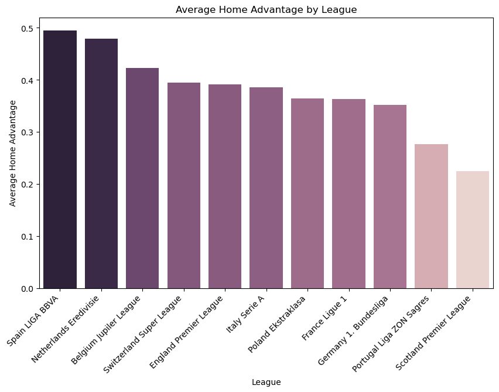
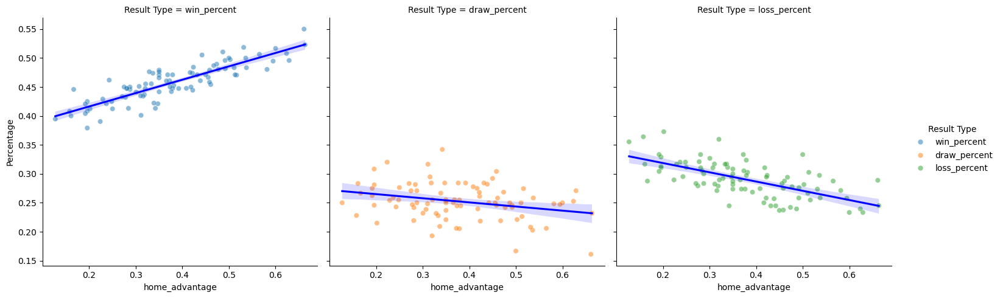
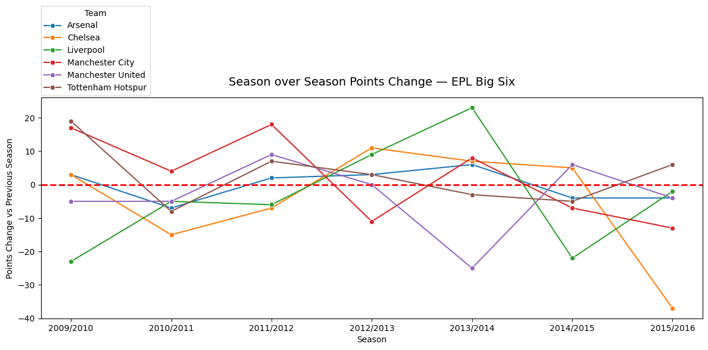

# Football Analysis

## Executive Summary
Analysis of 88 league-seasons across 11 European football leagues (2008–2016) using SQL and Python to quantify home team advantage and its effect on match outcomes. Every league-season in the dataset showed a measurable home advantage, with home teams scoring at least 0.12 more goals per game than away teams on average. La Liga showed the strongest home advantage while the Scottish Premier League showed the weakest.

## Key Visuallizations

* Figure 1: Average home advantage (goals scored above away team) by league across all seasons. La Liga leads with the highest home advantage; the Scottish Premier League shows the weakest effect.
  

* Figure 2: Scatter plots showing the relationship between a league's home advantage and home win, draw, and loss rates. Home win percentage is strongly predicted by home advantage (R^2^ = 0.74, p < 0.0001), while draw percentage shows a much weaker relationship (R² = 0.08, p = 0.006).

* Figure 3: Season-over-season points change for EPL Big Six clubs. Most clubs fluctuated within less than10 points of the previous season. Chelsea's 2015/16 season stands out as the most dramatic single-season decline in the group.

## Findings
* **Universal home advantage:** Every one of the 88 league-seasons analyzed showed a positive home advantage — home teams consistently outscored away teams regardless of league or season
* **La Liga vs Scottish Premier League:** La Liga had the highest average home advantage across seasons; Scotland's 12-team league with Celtic and Rangers dominating may reduce competitive variance and suppress home advantage
* **Home advantage predicts wins, not draws:** A league's home advantage is a strong predictor of home win rate (R^2^ = 0.74) but a poor predictor of draw rate (R^2^ = 0.08), suggesting draws are driven by other factors
* **EPL Big Six stability:** Most top clubs changed by fewer than 10 points season over season, suggesting consistent performance at the top of the table — with Chelsea's 2015/16 collapse as a notable outlier

## Methodology
Data source: European Soccer Database — 25,000+ matches across 11 leagues, 2008–2016  
SQL: Four analyses written in SQLite using CTEs, window functions (RANK, LAG, rolling AVG/SUM), and multi-table joins (see queries/)  
Python: Results exported from SQL as CSVs and visualized using pandas, matplotlib, seaborn, and plotly  
Statistical testing: Linear regression using scipy.stats.linregress to assess significance of home advantage trends (all results significant at p < 0.05)
